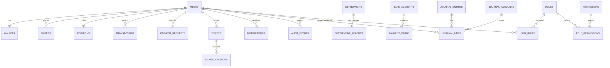

# ER Diagram

```mermaid
erDiagram
  USERS ||--|| WALLETS : has
  USERS ||--o{ ORDERS : places
  USERS ||--|| POSITIONS : holds
  USERS ||--o{ TRANSACTIONS : records
  USERS ||--o{ PAYMENT_REQUESTS : submits
  USERS ||--o{ TICKETS : opens
  SETTLEMENTS ||--|| SETTLEMENT_REPORTS : summarizes
  BANK_ACCOUNTS ||--o{ PAYMENT_CARDS : contains
  TICKETS ||--o{ TICKET_MESSAGES : contains
  USERS ||--o{ NOTIFICATIONS : receives
  USERS ||--o{ AUDIT_EVENTS : triggers

  JOURNAL_ENTRIES ||--o{ JOURNAL_LINES : has
  JOURNAL_ACCOUNTS ||--o{ JOURNAL_LINES : posts
  USERS ||--o{ JOURNAL_LINES : relates

  USERS ||--o{ USER_ROLES : assigned
  ROLES ||--o{ USER_ROLES : assigned
  ROLES ||--o{ ROLE_PERMISSIONS : grants
  PERMISSIONS ||--o{ ROLE_PERMISSIONS : grants
```
