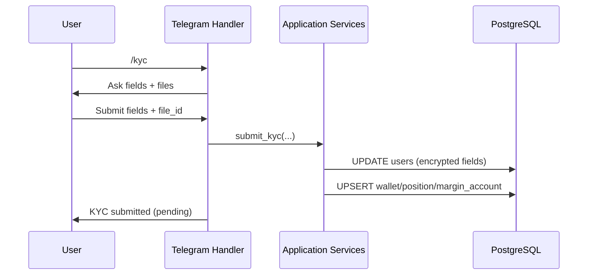
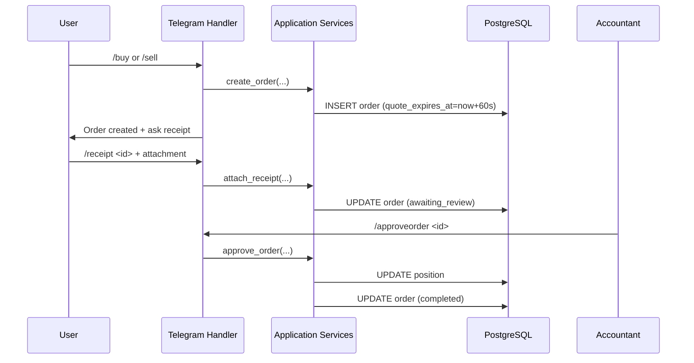
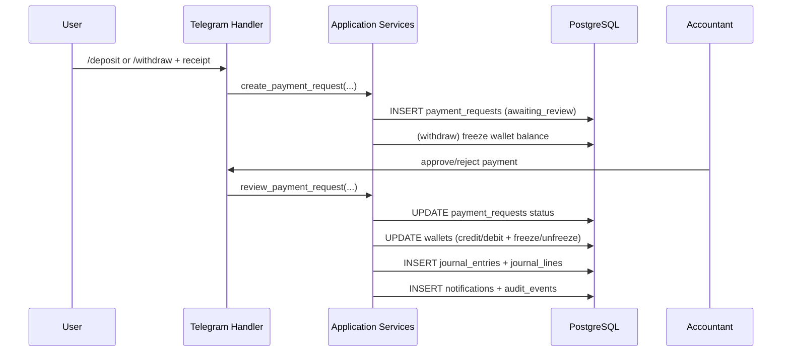

# Sequence Diagrams

## Registration / KYC

```mermaid
sequenceDiagram
  participant U as User
  participant T as Telegram Handler
  participant A as Application Services
  participant DB as PostgreSQL

  U->>T: /kyc
  T->>U: Ask fields + files
  U->>T: Submit fields + file_id
  T->>A: submit_kyc(...)
  A->>DB: UPDATE users (encrypted fields)
  A->>DB: UPSERT wallet/position/margin_account
  T->>U: KYC submitted (pending)
```

## Order + Receipt + Approval

```mermaid
sequenceDiagram
  participant U as User
  participant T as Telegram Handler
  participant A as Application Services
  participant DB as PostgreSQL
  participant ACC as Accountant

  U->>T: /buy or /sell
  T->>A: create_order(...)
  A->>DB: INSERT order (quote_expires_at=now+60s)
  T->>U: Order created + ask receipt
  U->>T: /receipt <id> + attachment
  T->>A: attach_receipt(...)
  A->>DB: UPDATE order (awaiting_review)
  ACC->>T: /approveorder <id>
  T->>A: approve_order(...)
  A->>DB: UPDATE position
  A->>DB: UPDATE order (completed)
```

## Deposit / Withdrawal Review

```mermaid
sequenceDiagram
  participant U as User
  participant T as Telegram Handler
  participant A as Application Services
  participant DB as PostgreSQL
  participant ACC as Accountant

  U->>T: /deposit or /withdraw + receipt
  T->>A: create_payment_request(...)
  A->>DB: INSERT payment_requests (awaiting_review)
  A->>DB: (withdraw) freeze wallet balance
  ACC->>T: approve/reject payment
  T->>A: review_payment_request(...)
  A->>DB: UPDATE payment_requests status
  A->>DB: UPDATE wallets (credit/debit + freeze/unfreeze)
  A->>DB: INSERT journal_entries + journal_lines
  A->>DB: INSERT notifications + audit_events
```
